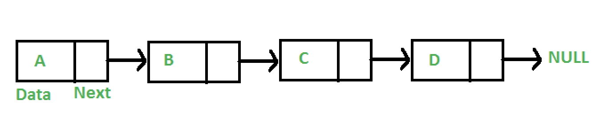
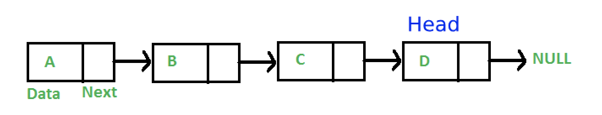
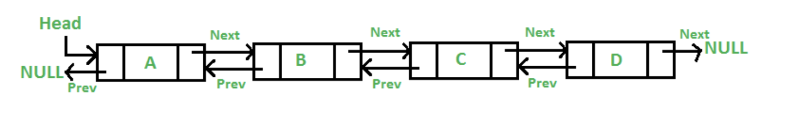
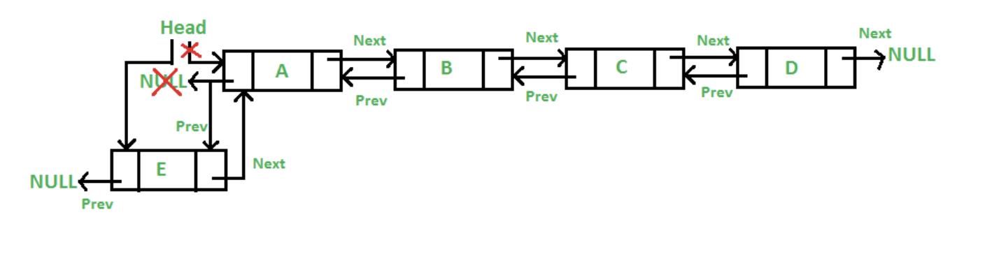
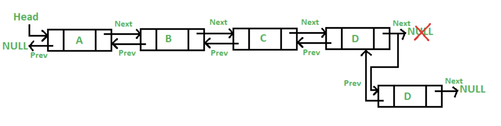
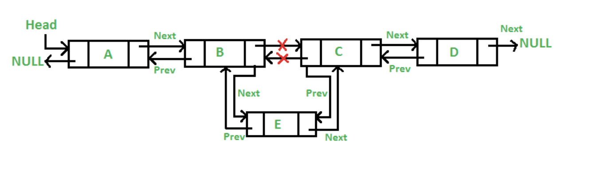

# Please edit the following information in your assignment

- Name: Raymond You
- How many hours did it take you to complete this assignment? 8
- Did you collaborate with any other students/TAs/Professors? No
- Did you use any external resources? (Cite them below)
  - None
- (Optional) What was your favorite part of the assignment?
- (Optional) How would you improve the assignment?

# Logistics

For this assignment (and every assignment/lab), you must login into the servers through `your_khoury_name@login.khoury.neu.edu` to complete and test your work. The reason is the examples I will provide below are compiled strictly for our machines architecture, and this is a consistent architecture where your submission will be graded.


# Doubly Linked List *(DLL)*

In Lab2 you implemented what is callled a [singly linked list](https://www.geeksforgeeks.org/linked-list-set-1-introduction/).
The code for our node struct looked like this:

```cpp
typedef struct node{
	int myData;
	struct node* next;
}node_t;
```

Similarly our [stack](https://en.wikipedia.org/wiki/Stack_(abstract_data_type)) (Assignment 2, Part 2)
looked like this:

```cpp
typedef struct stack{
	int count;		
	unsigned int capacity;	// Stores the maximum size of our stack
	node_t* head;		// head points to a node on the top of our stack.
}stack_t;
```

In this assignment we are going to build on these ideas to create what is called a [doubly linked list](https://en.wikipedia.org/wiki/Doubly_linked_list) or a *DLL*

# Reflection on the previous implementation. 

* What did you do to reset the head each time you dequed an element from the stack?

First I check if the stack is null. Next, I check if the stack is empty. Finally, I set a temp node to the current head of the stack, get the data from this head, update the new head to be the next node of the current head, do some cleanup operations, and then return the node.

* If the stack had n elements how many operations (i.e comparisisons ) did you have to do to reset the head?

Only two operations happen as we get the current head and update the new head to be the current head's next node.

* How would you express this in big Oh notation.

O(1) = O(1) + O(1)

* What do you think you can do to make the dequeing constant time?

It is already done in constant time. Operations are all constant time. It's just that this is a single linked list so you can't add to both directions.

* What are some operations that the stack doesn't provide that would proove desirable?

Peak: Return the top of the stack without dequeing it

Print: Print all elements currently in the stack 

# The pictures behind the code

You might have guessed about adding a *previous* field to our *node* that would point to the previous neighbor of a node. You guessed right. By doing this you would have created a [doubly linked list](https://en.wikipedia.org/wiki/Doubly_linked_list) or a *DLL*. 

Lets try to visualize how our *DLL* would look like. To begin, our single linked list can be pictured like this:



Each *node* stores the data and a *pointer* to the next node. 

Note that our stack looked almost exactly like our list:



By adding a *previous* field to our node our list would like like this:



Thus a node will know who comes before and after it. 

# Our new DLL struct

Remember that our stack linked the nodes for us when we enqueued an element? The stack did this by using a variable *head* which stores the position of where the next element needs to go. In our new *DLL* struct besides having a *head* pointer we are also going to add a *tail* pointer. *head* will point to the start of the *DLL* and the *tail* will point to the end of the *DLL*. This will enable us efficient adding and removing at both ends of the *DLL*.

```cpp
typedef struct DLL{
	int count;		
	node_t* head;		// head points to the first node in our DLL.
	node_t* tail;		// head points to the last node in our DLL.
}dll_t;
```

# Implementing a Doubly Linked List (Your TO DO )

Implement the functions provided to you in the *dd_list.h* file. Do not modify the signatures ( names and arguments ) of these functions just provide the implementation (i.e. body of code) in a separate c file. Please modify the Makefile by adding a command `all` that builds your program. 

## Drawing a picture can help.

Note that drawing a picture of what needs to happen for each operation will help. For example:

* push_front



* push_back



* insert(int index, int data)



### Unit Tests

A unit test is a standalone test that checks for the correctness of a specific use case in your code. In our case, we are testing if we have a working *DLL* implementation. 

Please write unit tests to test your implementation. Some example tests we might come up with include:

* Fill a *DLL*, empty the *DLL*, and fill the *DLL* again.
* Test each function in your *DLL* when the *DLL* is not empty.
* Test each function in your *DLL* when the *DLL* is empty.
* etc.

# Rubric

- 100% Correct Doubly-Linked List(DLL) implementation
  - All functions should be implemented. Do not rename the functions, but you may add any 'helper' functions if you deem necessary.
    - (e.g. You might have a 'double_linked_list_print' to help you debug)
  - There should be no memory leaks
  - There should be no bugs in your functions 
  - Your implementation will be graded by our set of unit tests, and we will check your code 'style' as well.

# Resources to help

- This is a nice interactive tutorial for learning C
  - http://www.learn-c.org/
- Doubly Linked List Data Type High level description
  - https://en.wikipedia.org/wiki/Doubly_linked_list (abstract_data_type)
  
# Feedback Loop

(An optional task that will reinforce your learning throughout the semester)

- Investigate/Review more data strutures on this webpage: https://visualgo.net/en/list
  - There are visuals for the doubly-linked list here!
  - Use them as a *rough* outline for the general concept. Do make sure to follow the specifications above.

