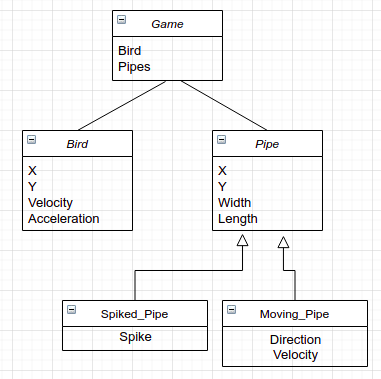

# Project Overview

Projects will be interactive programs developed in C++. They can be a game, finance engines, translators, face recognition programs,  audio interpreters etc ( these are all projects that students have done in the past). 

For the project, you can use any platform and IDE you prefer (Visual Studio, Xcode, etc.). Code can be written using C++98 or C++11 standards. 

The project code must be hosted on the CCIS GitHub in the account of one of the group members.
You must also provide build instructions. This is helpful not only for the us, but also for potential employers.

# Project Requirements:

* Written in C++.
* Interactive, and take frequent user input that updates the state of the program.
* Dynamically allocate and free memory.
* Use classes, inheritance, templates and generic algorithms.
* Be unit tested.
* Be of reasonable size and complexity.
* Make use of at least one "advanced" feature that requires an additional API, library, or SDK, as described below.

# Advanced Features:

The advanced feature will require independently researching, understanding, and using some external API, library, or SDK. 
Each project must include at least one advanced feature. Example advanced features include:

* Specialized Keyboard or Mouse Input (OpenInput, ncurses)
* AI/Algorithms (OpenSteer, Boost Graph Library, libnoise)
* Audio (OpenAL)
* 2D or 3D graphics (Simple DirectMedia Layer, OpenGL, DirectX)
* Physics (Box2D, Open Dynamics Engine)
* Networking (sockets, libcurl)
* Embedded scripting (lua)
* Multithreading/multiprocessing (OpenCL, pthreads, Windows Threads)
* Presentation: In-class group presentation of projects towards the end of the semester.

# Teams

The project is supposed to be done in teams of two students. If you prefer to work alone that is fine too. 

# TODO

Provide answers to each of the following:

* List the team.

Raymond You (working alone here)

 * In a brief paragraph describe what you plan your project to be about.

*For my final project, I am going to recreate the popular mobile game that went viral, Flappy Bird. Flappy bird is a side-scroller game where the player controls a bird, and attempts to fly between columns of green pipes without hitting them. The longer you survive without hitting any green pipes, the higher your score will be.*

* List the target audience.

*The target audience of the game will be mainly children, teens, and young adults who like to play games. Due to the simple nature of the game, the game can probably be played by anyone. Also, due to the short time-length of each game, the target audience will be people who want to play something quick and doesn't take a long time to finish.*

* List several high level non functional requirements of your project ( i.e. you can list requirements about: 
Scalability, how scalable or extendable do you see this mini project being. Talk about possible future use or work 
that could be done. Maintainability, talk about how much you expect this to be maintained in the future, *etc.

*There will be several high level non-functional requirements for this project. I want the project to be scalable, such as maybe add multiplayer to it in the future, so people can compete realtime. This can be done maybe through websockets. I also want to add more custom elements to it such as you can change the look and appearance of the background, the bird, the pipes, and more. Furthermore, I want the code to be clean so that it can be maintainable in the future if either me or others want to hop on and contribute. Depending on the success and how fun it is to make this, I might maintain and add onto it in the future.*

* List several functional requirements (i.e. what tasks your project must do ).

*There will also be several functional requirements. First, the random generating of the location of each pipes. I don't want to hardcode where the current and the future green pipes will spawn as that isn't really maintainable and not-predictable. I am going to have to some how randomly generate the map, like how a maze is randomly generated each time so you can't just memorize the path after completing it once. The second thing is gravity, which may be tricky. When the bird goes up, it's velocity and acceleration should decrease. When the bird goes down, it's velocity and acceleration should increase. Third, I also need to keep track of the score and a scoreboard so the player will know how well he is playing.*

* List several use case scenarios of your project.

*Some use case scenarios of this project are as a quick game when you are bored, while also not having too much time to commit to a longer game. Another use case can be as a game to demonstrate how velocity and acceleration works in a game, and how the formula and coding up of it can be done. Overall, because this is a game, the main use case will be for the player to just have fun and enjoy playing it.*

* Provide a UML class diagram of possible design of your project. This doesn't have to be too detailed, you can update 
the UML diagrams as in a later deliverable. 

* Advance feature capability

SFML
* URL: https://www.sfml-dev.org/
* Documentation: https://www.sfml-dev.org/documentation/2.5.1/
* Functionality: Provides a interface to the various components of your PC to ease the development of games and multimedia applications. Composed of five modules: system, window, graphics, audio, and network.
* Use case in project: I am going to use this mainly for the generating of all the graphics such as the bird and background, the keyboard events, and maybe the audio library too.

Irrlicht
* URL: http://irrlicht.sourceforge.net/
* Documentation: http://irrlicht.sourceforge.net/docu/
* Functionality: An open source realtime 3D engine that is cross-platform and uses D3D, OpenGL, and its own software renderers.
* Use case in project: I am going to use this mainly for the generating of all the graphics such as the bird and background, and handling the keyboard events. Irrlicht engine is pretty complex and large, and I may explore its many other feature too.

# Rubric
* 15% of final project.
* Will be graded how detailed and thoughtfull your responses are. One sentance answers will not recieve many points. 
