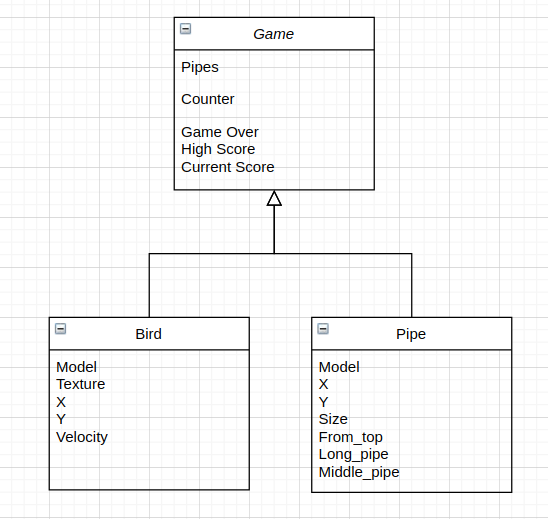

# Deliverable Overview

In the last deliverable you needed to develop a working example demonstratring the library/s you picked in action.
In this deliverable you need to demonstrate a working prototype of your project.

## Deliverable Requirements:

* Must show the project in action by building a running executable prototype. You must demonstrate at least one to two features
/requirements that you specified in your project 1 deliverable in action.
* You need to provide a PDF UML design document. The design document needs to include a UML class diagram showing the structure
of your project.
* Provde a one-two paragraph description of you design that goes over your UML design document and explains your design
decisions.
* Provide a test plan for you project. Explain how you plan on testing your project and provide at least one two tests.
* Record a short video and either post it on youtube or push it in this folder demonstrarting the prototype in action.

## UML Overview

My UML is pretty simple as the game essentially is pretty simple and only involves two classes. I plan on adding more classes in the future so I can utilize more polymorphism and inheritance concepts. In order to do that, I want to add different 'classes' of birds to make the game more interesting such as birds with special abilities such as teleporting through pipes or a burst of speed for a few seconds. In my UML, I have my main game model and in that game model, there consists of many pipes and a single bird.

## Test Plan

To test my game, I played it extensively to try to hit all edge cases. So far, I think I'm doing pretty well for handling all edge cases. For example, some of these edge cases are not allowing the bird to fly off the screen, making the game over if the bird falls off the screen, the bird when being super close to the pipe doesn't cause a game over aka making it pixel accurate.

## Short Video

https://drive.google.com/file/d/1XwLZFLOgY3fEzomXo-aLg5Wd12JQ046C/view?usp=sharing

## Answer the following questions:

Provide answers to each of the following:

* What dificulties did you face in deliverable 3?

The main difficulties were:

1. getting the pipes/rectangles to randomly generate and getting the pipe pair logic working properly (meaning if there is a randomly generated top pipe, the next pipe should be a bottom pipe directly below it with space for the bird to pass through)
2. figuring out the correct, hard-coded values for literally everything (the bird step size, the pipe width and length, the pipe x and y position, the bird x and y position)
3. incorporating gravity smoothly to the bird when it falls
4. cleaning up and making the code not too spaghetti so that it is easier to continue managing in the future

 *  What did you learn from the process, how you could improve on this and avoid similar mistaktes in the feature?

I learned that designing a game is not as easy as it looks. I always thought a game like flappy bird would take less than 5 hours to code. It did not take me 5 hours to do this. It took significantly more. On top of that, learning how to use a C++ library/game engine especially if it is your first time is pretty challenging. I'm not sure what I can improve on as it was my first time for everything in this project. It was my first C++ project, my first game project, my first usage of a game library. I can definitely improve on writing cleaner code and overall system design.

* If you have experience in another laguage, how do you find the process of building a larger project in C++?

I have experience in Python and Java and it is pretty much the same as building a larger project in other languages. You have to think carefully and thoughtfully how to split up the class models, class functions, and where everything should go. You also have to think a lot about future growth as you don't want to acculumulate too much tech debt as you go.

* Have you written any documentation yet?

Not as much as I would like as this is still far from the final state of this game and I would like to add a lot more to this game in the future. But I have written as much comments throughout the code as documentation throughout the coding process.

* How do you plan to test your project and what difficulties do you see?

I plan on testing my game by playing it more and trying to account for all possible edge cases. There are a lot of if/else branches in my code currently so I can easily just step through each branch and see if anything noteworthy happens or breaks. In terms of difficulty, I can see myself having trouble with not leaking memory as I am not sure how the SFML library works with their destructors and memory management.

 * Have you tested your code for any memory leaks?

I tried to but when I ran valgrind with my game, it just crashed with an error message that I have so far not deciphered the meaning of. I am pretty sure there are memory leaks throughout my game right now so that is something in the future for me to fix.

* How many hours have you spend on your project so far and do you enjoy programming in C++?

I have so far, spent around 10-15 hours on this project. It has been enjoyable as it is my first time programming in C++ and my first time doing game development. I plan on dabbling more in these two fields in the future after this class ends.

* Have you bought enough hand soap and toilet paper?

Still have enough for about 2 more weeks. Hopefully, it is not too hard to get hand soap and toilet paper 2 weeks from now!

# Rubric
* 20% of final project.
* Will be graded how detailed and thoughtfull your responses are. Unthoughtfull answers will not recieve many points.
