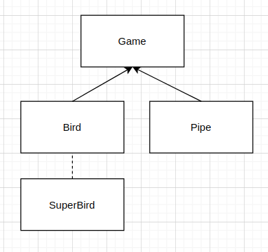

# Deliverable Overview

In the last deliverable you needed to develop a working prototype demonstrating at lest two features that you 
specified in your project 1 deliverable. In this last deliveralbe you need to provide the final version of your project. 

# Deliverable Requirements:

* A well demonstarted video going over your project (20%)
* Fully implemented advanced features (30%)
* Demonstarted use of classes, access specifiers (private vs public), use of const, data structures, 
inheritance, (polymorphism or templates optional)  (20%)
* Your project is tested and commented, has no memory leaks (20%)

# Bonus:
* Use of templates and generic algorithms, smart pointers, (15% - 5% each).
* Use of an extra advanced feature ( 15% )

# Answer the following questions (10%):

* What dificulties did you face in deliverable 4? 

Making the intro/select screen work properly and be fluid. Also, ran into some issues when the player selects a bird and flowing smoothly into the actual game as I wasn't sure what the SFML best practices were when switching game screens.

I realized that I made the pipes too close together and some parts were impossible for the bird to go through. It was tricky getting the hard-coded position values properly while also making the game not too easy. Getting the perfect space between two sets of pipes was tricky.

Making sure that I wasn't leaking any memory or the game wasn't lagging due to some game logic being done wrong.

 *  What did you learn from the process, how you could improve on this and avoid similar mistaktes in the feature?
 
Split up the main game function as you go and don't let it grow and become a giant mess. I realized that it was getting tricky following the flow of code as my main function was so long. I should've spent more time abstracting some of the code into functions so that it is easier to build on in the future.

C++ game development is tricky as there are so many threads and processes going on. It is very easy to lose track of a thread or have tons of loss memory. I learned to be super careful whenever I create a new object and always know what is happening during each game tick.

* Have you documented your code? 

Yes, I documented my code throughout in the cpp/hpp files especially the functions that have tricky logic. The simple/self-explanatory functions I didn't document.

* How did you test all major functionality of the project?

Because my project is a game, the best way to test all the major functionalities were to just play constantly and play as you develop, to make sure you don't have any regressions. I also sent this game to some of my friends to play to help me find bugs.
 
 * Does your project have any memory leaks? How did you test for memory leaks?

There are memory leaks but I believe the memory leaks and valgrind errors are due to the SFML library I am using and not because of any new code I wrote. I did some research online and found out that SFML has a weird compatibility issue with graphics card and it causes valgrind errors and tons of memory leak but that it is a false alarm. I double checked my code and wherever I initialized a new object, I made sure it was deleted at the end.
  
 * Tell us where we can find use of a datastructure and inheritance in your project.
 
I used mainly vectors throughout my project, but it is used a ton in the Game.hpp file throughout. I use a vector because I need a dynamic array that can resize accordingly due to the game state always changing.

For inheritance, I had my bird as the base class. I then have a super bird class thatt inherits from that bird. In the future, if I ever want to add a new type of bird class, I can just inherit my main bird base class so I don't have to rewrite all the basic functions that are shared throughout all the bird classes.
  
 * Tells us if you've implmented any of the bonus features, where we can find them, and what they are.
 
I would say the most advanced feature of this game that I implemented was the randomly generated, nondetermistic pipe generation. Each time the game is played, the location of all the pipes are different. That was especially tricky to do.
  
* Provide the URL to your demo or indicate where it is pushed in the repo
 
Part 1 Demo Video: https://drive.google.com/file/d/1sEx-t_S_VmpKNSUGBZIkbysUa4iWbaV9/view?usp=sharing

Part 2 Code Overview Video: https://drive.google.com/file/d/18iqYpPAgHQXGEjAeT8mWCQ9Dg8DTx_1K/view?usp=sharing
 
* How many hours have did you spend on the proejct?

25-30 hours

# Final UML

# Logistics

The demo video is to be delivered by Tuesday 04/14 at 8am. Normally we would have in class presentations but we will use the last class time to watch the videos provided by all teams. You can keep working on your project till Wednesday 04/15 at midnight. Let us know if you have any questions.

# Rubric
* 50% of final project.
* Will be graded how detailed and thoughtfull your responses are. Unthoughtfull answers will not recieve many points. 
