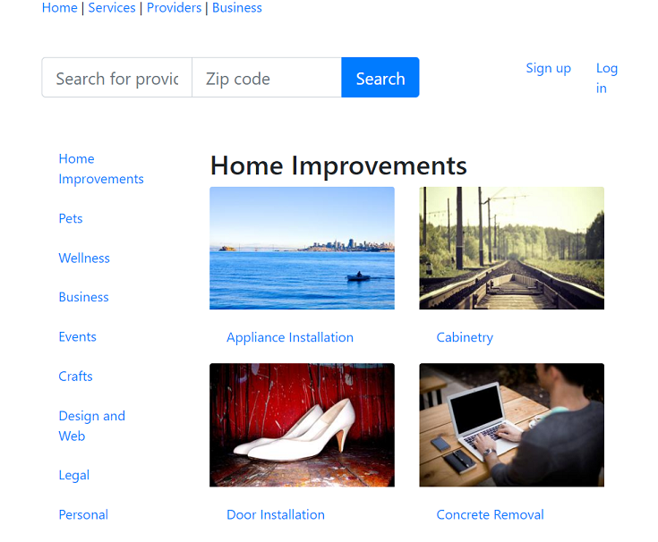
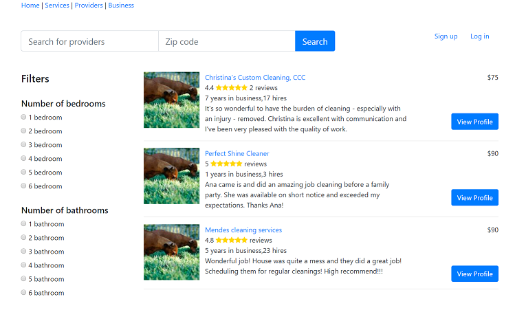
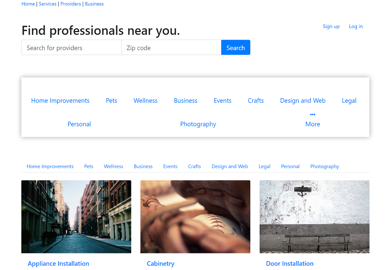

# GregsList

GregsList (definitely not Craigslist) is a marketplace for users who are in need of any services, to easily find businesses/providers that fit their needs. Third-party businesses/providers can put their services of any kind on display to sale to customers.

This was originally hosted on Heroku but I have lost the link and it is probably dead now anyways...

## Tech Stack

**Backend**: Java (Spring)

**Frontend**: React.js

**Database**: MySQL

## Deploy (TODO eventually...)

There are a dozen of guides out there on how to set up your VPS, domain, etc and deploy a Spring app with a React frontend. Should be simple enough!

## Images

