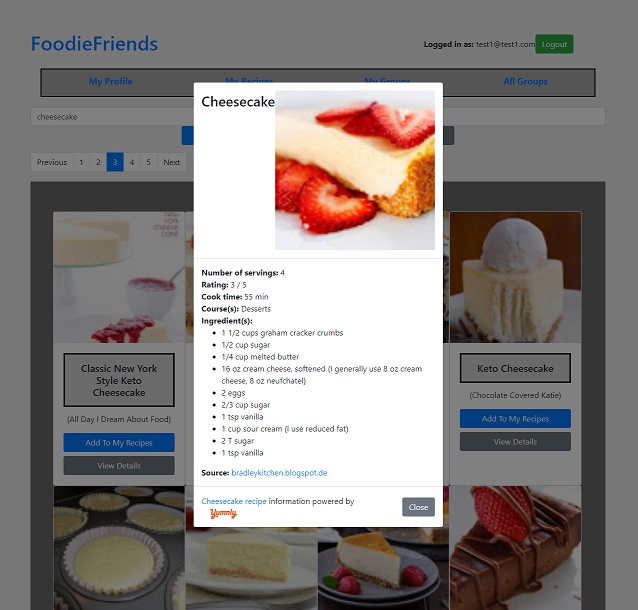

# FoodieFriends

A food/recipe app with social media aspects incorporated

  * Search for recipes of any category
  * Join food groups with friends
  * Send real time messages to other users

## Setting up

### API Requirements

Yummly

  * Sign up for a Yummly Developer account at https://developer.yummly.com/
  * In config\dev.exs, insert your "applicationId" and "applicationKey" provided by Yummly
  * If you are deploying to production, do the same in config\prod.exs
  
AWS

  * Sign up for an AWS Developer account at https://aws.amazon.com/
  * Create an S3 bucket and choose a region and save those values
  * In config\config.exs, insert your "access_key_id", "secret_access_key", "bucket (name)", and "region" provided by AWS in the appropriate locations 

### PostgreSQL Requirements

  * Create a new user and database in PostgreSQL, saving those values along with the password for that user. Also give appropriate user permissions to that database
  * In config\dev.exs, insert the "username", "password", "database" in the database config (config :foodiefriends, FoodieFriends.Repo). Hostname will most likely still be localhost for you.
  * For production and test, do the same in config\prod.exs and config\test.exs respectively.
  
### Running your server

To start your Phoenix server:

  * Install dependencies with `mix deps.get`
  * Create and migrate your database with `mix ecto.setup`
  * Install Node.js dependencies with `cd assets && npm install`
  * Start Phoenix endpoint with `mix phx.server`

Now you can visit [`localhost:4000`](http://localhost:4000) from your browser.

Ready to run in production? Please [check our deployment guides](https://hexdocs.pm/phoenix/deployment.html).

## Learn more

  * Official website: http://www.phoenixframework.org/
  * Guides: https://hexdocs.pm/phoenix/overview.html
  * Docs: https://hexdocs.pm/phoenix
  * Mailing list: http://groups.google.com/group/phoenix-talk
  * Source: https://github.com/phoenixframework/phoenix
  
## Attribution

  * Homepage image taken from https://www.alamy.com/
  * Default profile picture taken from https://www.facebook.com/
